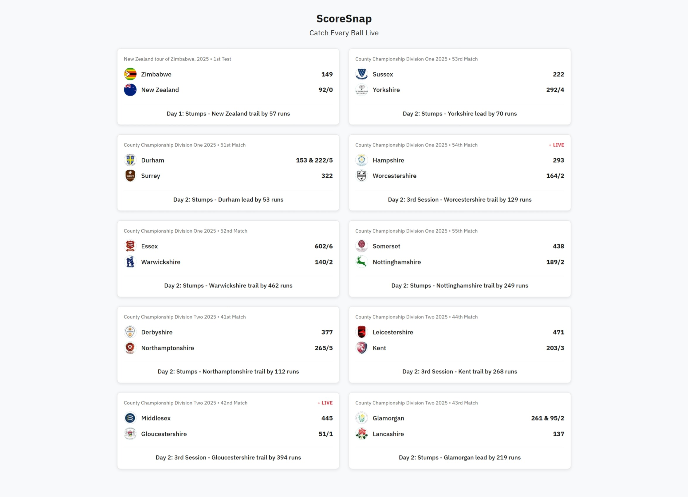

# ScoreSnap - Catch Every Ball Live!🏏

A modern, responsive cricket scoring web application that provides real-time match data and detailed scorecards.

## 🧩 Features
- **Live Match Tracking** with real-time updates
- **Detailed Scorecards** with batting and bowling statistics  
- **Multiple Format Support** (T20, ODI, Test matches)
- **Responsive Design** optimized for all devices
- **Team Logos** with fallbacks

## 💻 Tech Stack
- **Frontend**: HTML5, CSS3, Vanilla JavaScript
- **Styling**: Custom CSS with Flexbox/Grid
- **API**: Cricbuzz Cricket API via RapidAPI
- **Typography**: IBM Plex Sans

## 📂 File Structure
```
vignesh_live-cricket-tracker/
├── index.html                  # Main dashboard
├── match-detail.html           # Match details page
├── styles.css                  # Dashboard styles
├── match-detail.css            # Match detail styles
├── script.js                   # Dashboard functionality
├── match-detail.js             # Match detail functionality
├── favicon.ico                 # Cricket emoji icon
└── README.md
```

## 📷 Screenshots

### Main Dashboard


### Match Details


## 🚀 Getting Started

Open `index.html` in your browser or use a local server (python3 -m http.servver)

> ⚠️ **Free Tier Restriction**: This application uses a free tier subscription of RapidAPI, which allows up to 200 API calls. The application will stop functioning after this limit is exceeded.